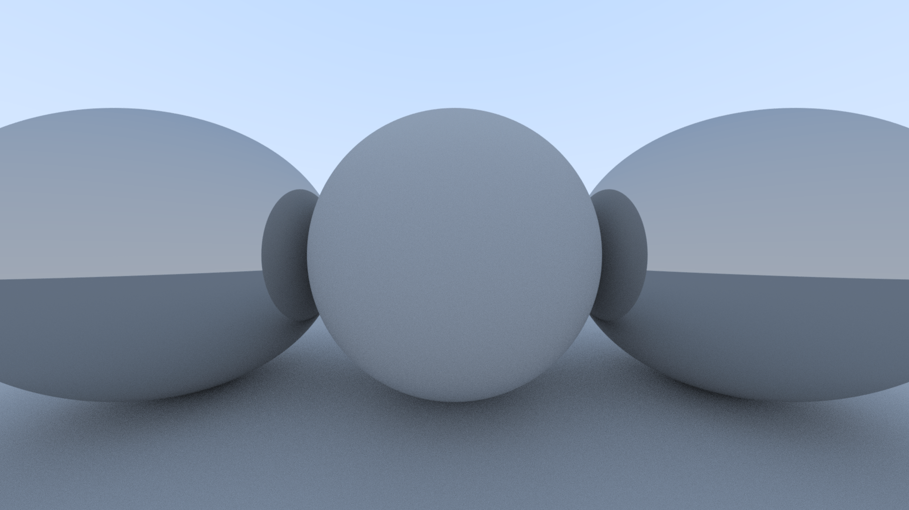
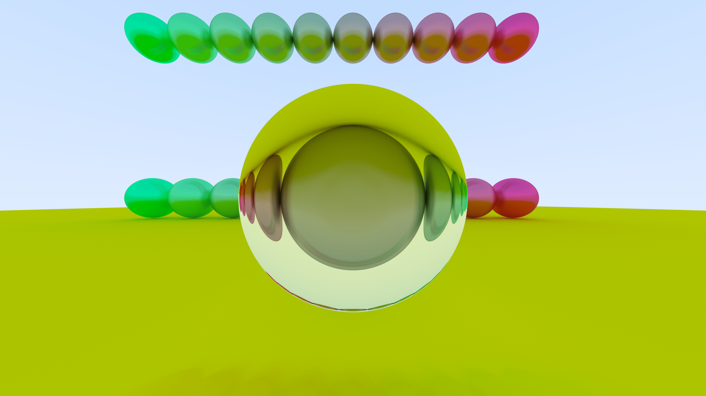

# Basic Ray tracing project

### Basic Sphere

### Spheres with reflection

### Added Color support

### Added Fuzzy Metal and Transparent Glass Materials

### Final Scene render with Lambertian, Metal and Dielectric Materials

####This project was heavily inspired by the book [_Ray Tracing in One Weekend_](https://raytracing.github.io/books/RayTracingInOneWeekend.html)